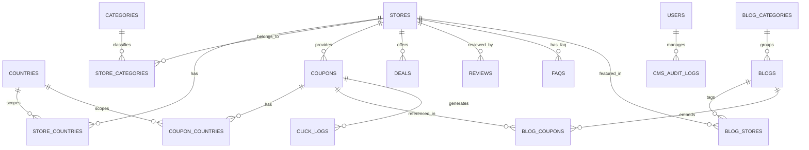
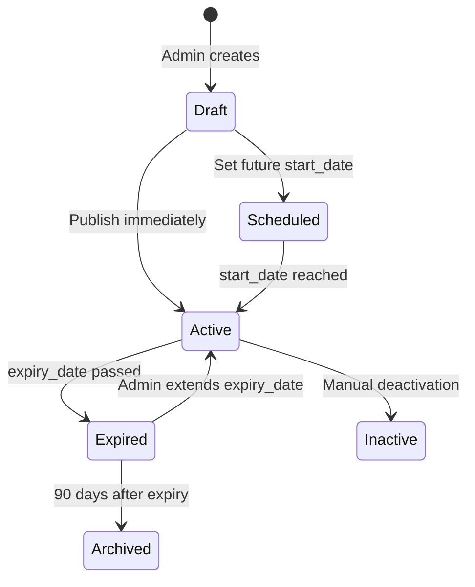

# RefPromos.com — Core Architecture & Technical Specification

> **Document Version:** 1.0  
> **Status:** Approved Architecture Reference  
> **Domain:** `refpromos.com`  
> **Platform Type:** Multi-Region Coupon, Deals, Store Directory, Reviews & Affiliate Content Platform  

---

## 1. Executive Summary & Product Vision

**RefPromos.com** is a high-performance, multi-region affiliate deals and coupon discovery platform designed to connect online shoppers with active verified discount codes, exclusive promotional deals, brand reviews, and shopping guides. 

The primary business and user journey is:
```
User Search / Google SEO ──► Store / Deal Landing Page ──► View Coupon / Deal ──► Click CTA (Affiliate Redirect) ──► Merchant Website & Conversion
```

### Core Platform Goals
1. **High Affiliate Conversion:** Frictionless coupon copying and redirection mechanism.
2. **SEO Supremacy:** High-speed Server-Side Rendering (SSR), structured data (Schema.org JSON-LD), canonical paths, and rich internal linking.
3. **Multi-Region Scalability:** Country-specific content isolation and currency formatting without codebase duplication.
4. **Complete CMS Autonomy:** 100% of stores, coupons, deals, blogs, reviews, categories, and SEO metadata managed without developer code changes.
5. **Zero Data Fragility:** Strict relational integrity so deleting or modifying entities never corrupts public pages or affiliate links.

---

## 2. 3-Tier System Architecture Diagram

```
===================================================================================================
                                1. ADMIN / CMS CONTROL PLANE
===================================================================================================
  ┌──────────────┐   ┌──────────────┐   ┌──────────────┐   ┌──────────────┐   ┌──────────────────┐
  │ Stores CRUD  │   │Coupons/Deals │   │  Categories  │   │ Multi-Region │   │  Blogs & Reviews │
  └──────┬───────┘   └──────┬───────┘   └──────┬───────┘   └──────┬───────┘   └────────┬─────────┘
         │                  │                  │                  │                    │
         └──────────────────┼──────────────────┼──────────────────┼────────────────────┘
                            │
                            ▼
===================================================================================================
                             2. CORE DATA & BUSINESS LOGIC ENGINE
===================================================================================================
                     ┌─────────────────────────────────────────────────┐
                     │              GLOBAL SCOPING ENGINE              │
                     │  • Multi-Country Scope (US, UK, AU, CA, DE, etc)│
                     │  • Category Tree & Taxonomy Hierarchy           │
                     └────────────────────────┬────────────────────────┘
                                              │
             ┌────────────────────────────────┼────────────────────────────────┐
             ▼                                ▼                                ▼
   ┌───────────────────┐            ┌───────────────────┐            ┌───────────────────┐
   │   STORE ENGINE    │            │COUPON/DEAL ENGINE │            │  CONTENT ENGINE   │
   │ • Store Profiles  │◄──────────►│ • Promo Codes     │◄──────────►│ • Shopping Blogs  │
   │ • Brand Reviews   │            │ • Verified Badges │            │ • Store Reviews   │
   │ • FAQs & Details  │            │ • Auto-Expiry     │            │ • Buying Guides   │
   └─────────┬─────────┘            └─────────┬─────────┘            └─────────┬─────────┘
             │                                │                                │
             └────────────────────────────────┼────────────────────────────────┘
                                              │
                                              ▼
                     ┌─────────────────────────────────────────────────┐
                     │            SEO, CACHE & SEARCH ENGINE           │
                     │ • Dynamic JSON-LD Schemas (Breadcrumbs/Offer)   │
                     │ • Instant Global Search & Autocomplete          │
                     │ • XML Sitemap, Robots.txt & Canonical Engine    │
                     └────────────────────────┬────────────────────────┘
                                              │
===================================================================================================
                               3. PUBLIC PRESENTATION & CONVERSION
===================================================================================================
                                              │
                                              ▼
                     ┌─────────────────────────────────────────────────┐
                     │                 PUBLIC WEBSITE                  │
                     │  • Responsive Homepage & Dynamic Search Hero    │
                     │  • SEO Store Pages & Category Hubs              │
                     │  • Blog & Review Hubs with Linked Offers        │
                     │  • Multi-Country Switcher & Region Sync         │
                     └────────────────────────┬────────────────────────┘
                                              │ (User clicks "Get Code" / "Get Deal")
                                              ▼
                     ┌─────────────────────────────────────────────────┐
                     │        AFFILIATE & TRACKING ENGINE (/out/:id)   │
                     │  • Server-side Click Logging (IP/Country/SubID) │
                     │  • Open Merchant Tab via Tracking URL           │
                     │  • Trigger In-App "Reveal Code & Copy" Modal    │
                     └────────────────────────┬────────────────────────┘
                                              │
                                              ▼
                                 ┌─────────────────────────┐
                                 │    MERCHANT WEBSITE     │
                                 └─────────────────────────┘
```

---

## 3. Database Schema & Entity Relationships



### Relational Entity Definitions

#### 1. `countries`
- `id` (UUID/Int, PK)
- `code` (VARCHAR(2), UNIQUE — e.g. `US`, `UK`, `AU`, `CA`, `DE`, `FR`, `IT`, `NL`)
- `name` (VARCHAR(100))
- `currency_symbol` (VARCHAR(10) — e.g. `$`, `£`, `€`)
- `currency_code` (VARCHAR(3) — e.g. `USD`, `GBP`, `EUR`)
- `flag_icon` (VARCHAR(255))
- `is_active` (BOOLEAN, default `true`)
- `sort_order` (INTEGER)

#### 2. `categories` & `blog_categories`
- `id` (UUID/Int, PK)
- `name` (VARCHAR(100))
- `slug` (VARCHAR(120), UNIQUE)
- `icon` (VARCHAR(255))
- `image_url` (VARCHAR(255))
- `description` (TEXT)
- `parent_id` (Nullable FK $\rightarrow$ `categories.id` for sub-categories)
- `is_featured` (BOOLEAN)
- `seo_title` (VARCHAR(255))
- `meta_description` (TEXT)

#### 3. `stores`
- `id` (UUID/Int, PK)
- `name` (VARCHAR(150))
- `slug` (VARCHAR(160), UNIQUE)
- `logo_url` (VARCHAR(255))
- `banner_url` (VARCHAR(255))
- `short_description` (TEXT)
- `long_description` (TEXT)
- `merchant_url` (VARCHAR(500))
- `affiliate_url` (VARCHAR(500))
- `tracking_params` (JSONB / TEXT)
- `rating_score` (DECIMAL(2,1), default 5.0)
- `rating_count` (INTEGER, default 1)
- `is_featured` (BOOLEAN, default `false`)
- `is_popular` (BOOLEAN, default `false`)
- `status` (ENUM: `active`, `inactive`, `draft`)
- `seo_title` (VARCHAR(255))
- `meta_description` (TEXT)
- `canonical_url` (VARCHAR(255))
- `created_at`, `updated_at` (TIMESTAMP)

#### 4. `coupons`
- `id` (UUID/Int, PK)
- `store_id` (FK $\rightarrow$ `stores.id`, ON DELETE CASCADE)
- `title` (VARCHAR(255))
- `description` (TEXT)
- `coupon_code` (VARCHAR(100), NULL for direct deals)
- `discount_value` (VARCHAR(50) — e.g. `20%`, `$50`, `Free Shipping`)
- `discount_type` (ENUM: `percentage`, `fixed_amount`, `free_shipping`, `cashback`, `other`)
- `coupon_type` (ENUM: `coupon_code`, `promo_code`, `discount`, `sale`, `deal`, `free_shipping`, `cashback`, `other`)
- `cta_text` (VARCHAR(50), default `'Get Code'` / `'Get Deal'`)
- `affiliate_url_override` (VARCHAR(500), NULL $\rightarrow$ falls back to `store.affiliate_url`)
- `start_date` (TIMESTAMP)
- `expiry_date` (TIMESTAMP, NULL if lifetime)
- `is_verified` (BOOLEAN, default `true`)
- `last_verified_at` (TIMESTAMP)
- `is_featured` (BOOLEAN, default `false`)
- `status` (ENUM: `active`, `expired`, `draft`, `scheduled`, `inactive`)
- `terms_conditions` (TEXT)
- `seo_title` (VARCHAR(255))
- `meta_description` (TEXT)

#### 5. `deals`
- `id` (UUID/Int, PK)
- `store_id` (FK $\rightarrow$ `stores.id`)
- `title` (VARCHAR(255))
- `description` (TEXT)
- `image_url` (VARCHAR(255))
- `deal_url` (VARCHAR(500))
- `affiliate_url` (VARCHAR(500))
- `discount_value` (VARCHAR(50))
- `start_date`, `expiry_date` (TIMESTAMP)
- `is_featured` (BOOLEAN)
- `status` (ENUM: `active`, `expired`, `inactive`)

#### 6. `blogs`
- `id` (UUID/Int, PK)
- `category_id` (FK $\rightarrow$ `blog_categories.id`)
- `title` (VARCHAR(255))
- `slug` (VARCHAR(255), UNIQUE)
- `excerpt` (TEXT)
- `content` (LONGTEXT / Markdown)
- `featured_image` (VARCHAR(255))
- `author_name` (VARCHAR(100))
- `status` (ENUM: `draft`, `published`, `scheduled`)
- `published_at` (TIMESTAMP)
- `seo_title` (VARCHAR(255))
- `meta_description` (TEXT)

#### 7. `reviews`
- `id` (UUID/Int, PK)
- `store_id` (FK $\rightarrow$ `stores.id`, UNIQUE)
- `title` (VARCHAR(255))
- `slug` (VARCHAR(255), UNIQUE)
- `rating` (DECIMAL(2,1))
- `summary` (TEXT)
- `pros` (JSONB / Array of strings)
- `cons` (JSONB / Array of strings)
- `verdict` (TEXT)
- `detailed_content` (LONGTEXT)
- `author_name` (VARCHAR(100))
- `status` (ENUM: `draft`, `published`)
- `seo_title` (VARCHAR(255))
- `meta_description` (TEXT)

#### 8. `faqs`
- `id` (UUID/Int, PK)
- `entity_type` (ENUM: `store`, `blog`, `review`, `general`)
- `entity_id` (UUID/Int)
- `question` (VARCHAR(300))
- `answer` (TEXT)
- `sort_order` (INTEGER, default 0)

#### 9. `click_logs`
- `id` (UUID/Int, PK)
- `coupon_id` (Nullable FK $\rightarrow$ `coupons.id`)
- `store_id` (FK $\rightarrow$ `stores.id`)
- `country_code` (VARCHAR(2))
- `sub_id` (VARCHAR(100))
- `ip_hash` (VARCHAR(64))
- `user_agent` (VARCHAR(255))
- `referer` (VARCHAR(255))
- `created_at` (TIMESTAMP)

#### 10. `site_settings`
- `key` (VARCHAR(100), PK)
- `value` (LONGTEXT)
- `group_name` (ENUM: `general`, `branding`, `seo`, `analytics`, `social`, `contact`)

---

## 4. Multi-Region & Localization Engine

### Universal Scoping Mechanism
1. **Detection & Selection:**
   - Default region detected from geolocation or URL prefix/cookie (e.g. `US`).
   - Region selector available in Header and Footer.
2. **Filtering Logic:**
   - Queries for Stores and Coupons apply `country_code` filter matching user's current region or `all_regions = true`.
3. **Currency & Locale Presentation:**
   - Dynamic currency symbol formatting based on the selected country (`$`, `£`, `€`).
4. **Hreflang & Multi-Region SEO:**
   - Multi-country pages render `<link rel="alternate" hreflang="en-US" href="...">` tags to avoid duplicate content penalties across geographic variations.

---

## 5. Coupon Lifecycle & Auto-Expiry Engine



* **Active Offers:** Displayed on Homepage, Coupons Hub, and prominently at the top of Store Detail pages.
* **Expired Offers:** Automatically moved into a "Recently Expired Coupons" collapsible archive on the store page.
* **SEO Protection:** Expired coupon pages do not trigger 404 errors; they preserve the URL structure to maintain organic keyword rankings and recommend active alternative stores/deals.

---

## 6. Affiliate Conversion & Outbound Tracking Architecture

```
[User on Public Page]
         │
         │  1. Clicks CTA ("Get Code" / "Get Deal")
         ▼
[Frontend Interceptor] ────► Displays "Coupon Code Revealed" Modal (Copy Code button)
         │
         │  2. Triggers window.open('/out/coupon/:id', '_blank')
         ▼
[Server-Side Redirect Endpoint: /out/coupon/:id]
         │
         ├──► Logs click in `click_logs` (Device, Region, Timestamp, SubID)
         ├──► Injects Affiliate Network SubID & UTM tracking parameters
         └──► Issues 302/307 Redirect to Merchant Landing Page
```

---

## 7. SEO & Schema.org JSON-LD Architecture

Every page is rendered with semantic HTML5 and validated Schema.org JSON-LD structured data:

1. **Sitewide:**
   - `Organization` & `WebSite` Schema with SearchAction markup.
   - Dynamic OpenGraph (`og:title`, `og:image`, `og:description`) & Twitter Card metadata.
2. **Store Page (`/stores/[slug]`):**
   - `Store` / `Organization` schema with `AggregateRating` and `offers` array.
   - `BreadcrumbList` Schema (`Home` $\rightarrow$ `Stores` $\rightarrow$ `Store Name`).
   - `FAQPage` Schema for store-specific FAQs (enables Google FAQ rich results).
3. **Coupon Detail (`/coupons/[slug]`):**
   - `SaleEvent` / `Offer` schema with `priceSpecification` and `validThrough` date.
4. **Blog Page (`/blogs/[slug]`):**
   - `BlogPosting` / `Article` schema with `author`, `datePublished`, `dateModified`.
5. **Review Page (`/reviews/[slug]`):**
   - `Review` schema with `itemReviewed`, `reviewRating`, `pros`, `cons`.

---

## 8. Dynamic Internal Linking Strategy

To ensure zero orphan pages and maximize Google link equity distribution:

| Source Page | Target Links Embedded |
| :--- | :--- |
| **Blog Post** | Store profile, live coupon cards, related blog articles, category hub. |
| **Review Page** | Store profile, active coupons, related buying guides, parent category. |
| **Store Page** | All store coupons, in-depth review link, related shopping guides, related competitor stores. |
| **Category Page** | Top stores in category, trending coupons in category, category buying guides. |
| **Homepage** | Featured brands, popular categories, top verified coupons, latest shopping guides. |

---

## 9. Security & Performance Specifications

### Security
* **Authentication:** Strong session tokens, hashed passwords (bcrypt/Argon2), secure HTTP-only cookies.
* **Input Sanitization:** Parameterized database queries (SQLi prevention), HTML sanitization via DOMPurify on blog/review contents (XSS prevention).
* **CSRF & Rate Limiting:** State tokens on forms, IP-based rate limiting on global search and contact endpoints.
* **Admin Route Protection:** All `/admin/*` routes strictly guarded by server-side authentication middleware.

### Performance & Core Web Vitals
* **Target:** LCP < 2.5s, FID/INP < 200ms, CLS < 0.1.
* **Optimizations:**
  - Modern WebP/AVIF image formats with native lazy loading.
  - Server-side caching for high-traffic store and category pages.
  - Zero heavy third-party bundle bloat; lightweight modular CSS.

---

## 10. CMS Management Modules Blueprint

The Admin CMS (`/admin`) provides full self-service content governance:

1. **Analytics Dashboard:** Total stores, active/expiring coupons, outbound affiliate click counters.
2. **Store Manager:** Add/edit/delete stores, upload logos/banners, configure affiliate links, set SEO titles/descriptions, assign categories/countries.
3. **Coupon & Deal Manager:** Create codes, set discount %, configure expiry dates, toggle verified status, customize CTA button text.
4. **Blog & Guide Editor:** Rich markdown/WYSIWYG editor, category assignment, author metadata, store/coupon tagger.
5. **Review Manager:** Rating breakdown, structured Pros & Cons builder, verdict editor.
6. **Country & Category Manager:** Enable/disable geographic regions, manage category hierarchies.
7. **Site Settings & SEO:** Manage site logo, Google Analytics 4 ID, Google Tag Manager ID, contact details, social links.

---

*This architecture file serves as the definitive engineering blueprint for RefPromos.com.*
