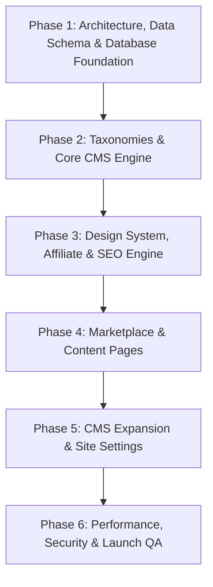

# GrabYourDealz.com — Project Execution Sequence & Roadmap

> **Document Version:** 1.0  
> **Status:** Approved Project Execution Sequence  
> **Goal:** High-velocity, zero-rework implementation roadmap for GrabYourDealz.com  

---

## 1. Overview & Strategy

This execution sequence organizes the requirements from the 44-page specification into **6 tightly integrated phases**. It resolves the dependency inversions of traditional waterfall planning by ensuring that:
1. **Taxonomies (Countries & Categories)** precede store and coupon creation.
2. **Core Conversion Engines (Affiliate Redirect & Modal UI)** are developed alongside shared components.
3. **SEO Infrastructure (Schemas, Breadcrumbs, Canonicals)** is built directly into page templates rather than added as an afterthought.

---

## 2. Comparison: Original Milestones vs. Refined Sequence

```
ORIGINAL 13 MILESTONES (High Rework Risk)             REFINED 6-PHASE SEQUENCE (Zero Rework)
─────────────────────────────────────────────         ────────────────────────────────────────────
M0: Requirements Finalization                         PHASE 1: Project Setup, Data Schema & DB
M1: UX/UI Design                                               • Unified DB models & initial seeds
M2: Architecture + Database                                    • Auth & security primitives
M3: Backend Foundation + Auth                         PHASE 2: Taxonomies & Core CMS Engine
M4: CMS Core (Stores/Coupons) ◄───┐                            • Countries & Categories first
M5: Country + Category Engine ────┘ [Rework Risk]              • Stores, Coupons & Deals CMS
M6: Frontend Foundation                               PHASE 3: Design System, Affiliate & SEO Engine
M7: Marketplace Pages ◄───────────┐                            • Shared UI, Themes & Navbar
M8: Blogs + Reviews               │                            • Outbound Affiliate redirect & modal
M9: Search + Affiliate Engine ────┘ [Rework Risk]              • Dynamic JSON-LD & Breadcrumb engine
M10: SEO Infrastructure                               PHASE 4: Core Marketplace & Content Pages
M11: Performance + Security                                    • Homepage, Stores & Coupons hub
M12: QA + Deployment                                           • Store Detail, Blogs & Reviews
                                                      PHASE 5: CMS Content & Settings Expansion
                                                               • Rich blog/review editors
                                                               • Global site settings & analytics
                                                      PHASE 6: Performance, Security & Launch QA
                                                               • Core Web Vitals, Schemas & Audits
```

---

## 3. Detailed Phase-by-Phase Roadmap



---

### 🔹 Phase 1: Project Setup, Data Schema & Database Foundation
**Goal:** Establish the rock-solid data foundation, models, and development environment.

* **Task 1.1 — Application Framework Initialization:**
  * Next.js App Router with TypeScript and strict type-checking.
  * Modular styling system with design token support (light/dark mode, brand colors).
* **Task 1.2 — Database Layer & ORM Configuration:**
  * Relational schema implementation based on [`architecture.md`](file:///e:/Zeeshan/Website/architecture.md).
  * Entities: `countries`, `categories`, `stores`, `coupons`, `deals`, `blogs`, `reviews`, `faqs`, `click_logs`, `site_settings`, `users`.
* **Task 1.3 — Seed Data Engine:**
  * Seed target countries: US, UK, AU, CA, DE, FR, IT, NL.
  * Seed core shopping categories: Fashion, Electronics, Travel, Home & Garden, Beauty, Software, Health & Fitness, Food & Dining.
  * Seed realistic sample stores, coupons, and shopping guides for immediate visual feedback.
* **Task 1.4 — Authentication & Security Baseline:**
  * Admin session authentication, password hashing, and protected route middleware.

**Deliverables:**
- Working database schema with complete migrations.
- Executable seed script with multi-region sample data.
- Protected `/admin` route with secure login.

---

### 🔹 Phase 2: Taxonomies & Core CMS Engine
**Goal:** Build the content management system from foundational taxonomies up to stores and coupons.

* **Task 2.1 — Taxonomy Management:**
  * **Countries / Regions:** Add/edit/toggle active countries, ISO codes, currencies (`$`, `£`, `€`), and flag icons.
  * **Categories:** Add/edit categories, icons, banners, and SEO metadata.
* **Task 2.2 — Store Management Module:**
  * Create, edit, publish/unpublish, and feature stores.
  * Upload store logos and hero banners.
  * Configure merchant links, affiliate URLs, and custom tracking parameters.
  * Assign multi-country availability and categories.
  * Manage store-specific FAQs and custom SEO title/meta tags.
* **Task 2.3 — Coupon & Deal Management Module:**
  * Create promo codes, discounts, cashback offers, and sales.
  * Set discount types (`%`, fixed amount, free shipping).
  * Configure start dates, countdown expiry dates, and verified badges.
  * Configure custom CTA text (`Get Code`, `Get Deal`, `Shop Now`).
  * Auto-expiry lifecycle management.

**Deliverables:**
- Fully functional Admin CMS Dashboard.
- Complete CRUD interfaces for Countries, Categories, Stores, Coupons, and Deals.

---

### 🔹 Phase 3: Design System, Affiliate & SEO Engine
**Goal:** Build the reusable UI design system, affiliate conversion mechanics, and SEO foundation.

* **Task 3.1 — Design System & Shared UI Components:**
  * Responsive navigation header with Country Switcher, Global Instant Search bar, and Mobile Drawer.
  * Reusable UI cards: Store Card, Coupon Card, Deal Card, Blog Card, Review Card.
  * Interactive components: Breadcrumb trails, badges, rating stars, pagination, newsletter box, footer.
* **Task 3.2 — Affiliate Outbound & Code Reveal Engine:**
  * Dedicated server-side redirect endpoint: `/out/coupon/:id` and `/out/store/:id`.
  * Click logging system (tracking coupon ID, store ID, country, timestamp, referer).
  * Interactive **Code Reveal Modal**:
    - Automatically opens merchant website in a new tab.
    - Displays copyable promo code with 1-click clipboard button.
    - Shows feedback prompt ("Did this code work?").
* **Task 3.3 — SEO Infrastructure Engine:**
  * Automated JSON-LD Schema generators (`Organization`, `WebSite`, `BreadcrumbList`, `Offer`, `Store`, `FAQPage`).
  * Dynamic meta tag and OpenGraph generators.
  * Dynamic `sitemap.xml` and `robots.txt` endpoints.

**Deliverables:**
- Responsive layout with working country selection and global search.
- Operational `/out/:id` affiliate tracking and Code Reveal modal.
- Native SEO and JSON-LD schema builder.

---

### 🔹 Phase 4: Core Marketplace & Content Pages
**Goal:** Assemble the high-converting public marketplace and SEO content pages.

* **Task 4.1 — Homepage (`/`):**
  * Dynamic Search Hero with store autocomplete.
  * Featured Brands Carousel & High-Performing Coupons.
  * Popular Stores Grid & Category Quick-Browser.
  * Top Shopping Guides & "Why GrabYourDealz" trust section.
* **Task 4.2 — Stores Directory (`/stores`):**
  * Multi-region filtering, category filter, A-Z alphabetical directory, search filter.
* **Task 4.3 — Dynamic Store Page (`/stores/[slug]`):**
  * Store header with rating summary, merchant link, and coupon counts.
  * Active Verified Coupons & Deals section with real-time CTA modals.
  * Store Review summary & Pros/Cons box.
  * Related shopping guides & Store FAQs accordion.
  * Collapsible "Recently Expired Coupons" archive (preserving SEO).
* **Task 4.4 — Coupons Hub (`/coupons`):**
  * Comprehensive coupon search and filter (by country, store, category, discount type, verified status).
* **Task 4.5 — Blogs & Reviews Hub (`/blogs`, `/reviews`):**
  * Blog listing and article view with embedded live coupon widgets.
  * Review listing and store review pages with ratings and verdict.
* **Task 4.6 — Static & Legal Pages:**
  * About Us, Contact Us (with working contact form), Privacy Policy, Terms & Conditions.

**Deliverables:**
- Complete public-facing website with dynamic routing and high visual fidelity.
- Interconnected internal linking between Stores, Coupons, Blogs, and Reviews.

---

### 🔹 Phase 5: CMS Content & Settings Expansion
**Goal:** Provide CMS editors with complete control over content, marketing scripts, and site configuration.

* **Task 5.1 — Blog & Review CMS Editors:**
  * Markdown / Rich text editor with image upload support.
  * Relational store and coupon linker for blog posts.
  * Structured Pros, Cons, and Verdict builder for reviews.
* **Task 5.2 — Site Settings & Analytics CMS:**
  * Manage site branding, logo, favicon, and contact email.
  * Configure Google Analytics 4 (GA4), Google Tag Manager (GTM), and Meta Pixel tracking IDs.
  * Dynamic legal page content editor.

**Deliverables:**
- Full editorial control over all articles, reviews, and site-wide marketing scripts.

---

### 🔹 Phase 6: Performance, Security, SEO Audit & Launch QA
**Goal:** Harden the system, optimize speed, validate SEO, and prepare for production deployment.

* **Task 6.1 — Core Web Vitals & Performance Optimization:**
  * Next-gen image optimization (WebP/AVIF), font optimization, asset minification.
  * Server caching and fast TTFB targets (LCP < 2.5s, CLS < 0.1).
* **Task 6.2 — Security Audit:**
  * Protection against SQL Injection, XSS sanitization (DOMPurify), CSRF validation, rate limiting.
* **Task 6.3 — SEO & Schema Validation:**
  * Google Rich Results testing on all JSON-LD schemas.
  * Canonical link integrity check and multi-region hreflang verification.
* **Task 6.4 — Responsive & Cross-Browser QA:**
  * Device testing on Mobile (iOS / Android), Tablet, Laptop, and 4K Desktop displays.

**Deliverables:**
- Production-ready, fully validated deployment bundle.

---

## 4. Summary Dependency Matrix

| Phase | Prerequisites | Core Output |
| :--- | :--- | :--- |
| **Phase 1** | None | DB Schema, ORM, Auth & Multi-Region Seeds |
| **Phase 2** | Phase 1 | Taxonomy & Store/Coupon CMS Modules |
| **Phase 3** | Phase 1, Phase 2 | Shared Design System, Affiliate `/out/:id` & SEO Schemas |
| **Phase 4** | Phase 3 | Public Pages (Homepage, Store, Coupons, Blogs, Reviews) |
| **Phase 5** | Phase 4 | CMS Editorial Expansion & Global Settings |
| **Phase 6** | Phase 4, Phase 5 | Security, Performance, SEO Validation & Launch QA |

---

*This sequence is documented in `sequence.md` and serves as the official roadmap for project implementation.*
